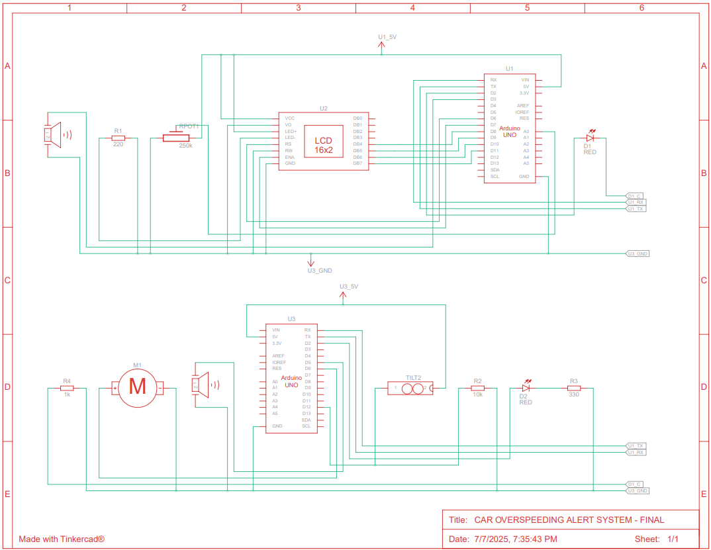
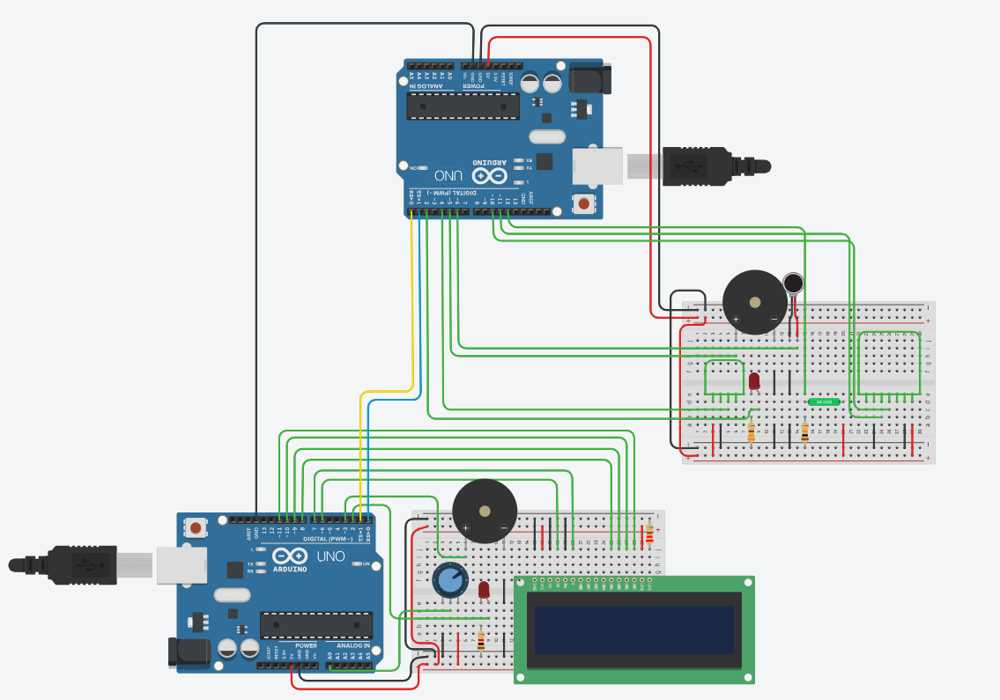

# Car Overspeeding Alert System

An Arduino-based prototype that detects car overspeeding and tilting using simulated sensors, and alerts nearby officers through serial, Bluetooth, and GSM modules using visual, auditory, and tactile feedback.

## Table of Contents

* [Overview](#overview)
* [System Components](#system-components)
* [Features](#features)
* [Installation and Setup](#installation-and-setup)
    * [Hardware Requirements](#hardware-requirements)
    * [Software Requirements](#software-requirements)
    * [Setup Instructions](#setup-instructions)
* [Circuit Description](#circuit-description)
    * [Sender Unit](#sender-unit)
    * [Receiver Unit](#receiver-unit)
    * [Schematic Diagram](#schematic-diagram)
    * [Tinkercad Circuit Diagram](#tinkercad-circuit-diagram)
* [How It Works](#how-it-works)
* [Code Structure](#code-structure)
* [Demonstration](#demonstration)
* [Possible Improvements](#possible-improvements)
* [License](#license)

## Overview

This project implements a simple embedded system to detect when a car exceeds a predefined speed limit or experiences abnormal tilt (suggesting instability or rollover). It consists of two Arduino microcontrollers:

* The **Sender Unit** simulates vehicle speed and sends alerts.
* The **Receiver Unit** receives alerts and triggers appropriate feedback mechanisms including LED, buzzer, vibration motor, and message transmission via GSM.

## System Components

* **Arduino UNO (x2)** — for sender and receiver
* **Analog Speed Sensor** (simulated with a potentiometer)
* **Tilt Sensor** — to detect abnormal vehicle orientation
* **LED** — visual alert
* **Buzzer** — audio alert
* **Vibration Motor** — tactile feedback
* **Bluetooth Module (HC-05/06)** — wireless alerting
* **GSM Module (SIM800L)** — remote messaging capability
* **LCD 16x2 Display** — real-time speed display

## Features

* **Real-time speed monitoring** using analog input
* **Speed threshold triggering** for overspeeding
* **Tilt detection** to simulate accidents
* **Alerts officers** via:
  * Serial connection
  * Bluetooth communication
  * GSM messaging
* Visual (LED), auditory (buzzer), and tactile (vibration) alerts
* **LCD display** for speed readout

## Installation and Setup

### Hardware Requirements

| Component         | Quantity |
| ----------------- | -------- |
| Arduino UNO       | 2        |
| Potentiometer     | 1        |
| Tilt Sensor       | 1        |
| LED               | 2        |
| Piezo Buzzer      | 2        |
| 220-ohm Resistor  | 1        |
| 330-ohm Resistor  | 1        |
| 10k-ohm Resistor  | 1        |
| Vibration Motor   | 1        |
| HC-05 Bluetooth   | 1        |
| SIM800L GSM       | 1        |
| LCD 16x2 Display  | 1        |
| Jumper wires      | lots     |
| Breadboard        | 1        |

### Software Requirements
- [Arduino IDE](https://www.arduino.cc/en/software)

### Setup Instructions

1. Clone the repository:

```bash
git clone https://github.com/Fidelisaboke/Car-Overspeeding-Alert-System.git
```

2. Open `sender.ino` and `receiver.ino` in the Arduino IDE.

3. Upload each code to separate Arduino boards.

4. Wire the components as per the circuit and connect the modules.

5. Power up and monitor via the Serial Monitor at 9600 baud.

## Circuit Description

### Sender Unit

* Reads analog input from potentiometer to simulate speed.
* Displays speed on LCD.
* If speed > `speedLimit`, sends `'1'` to Receiver.
* Sends `'0'` otherwise.

### Receiver Unit

* Receives alerts via Serial, Bluetooth, and GSM.
* If any interface sends `'1'`, it triggers alert:
  * LED ON
  * Buzzer ON
  * Vibration Motor ON
* If tilt sensor also activates, logs a **CRITICAL alert**.
* All outputs reset when `'0'` received.

### Schematic Diagram

_Fig 1: Schematic Diagram_

### Tinkercad Circuit Diagram

_Fig 2: Circuit Diagram_

## How It Works

1. **Sender** continuously reads simulated speed.
2. If speed exceeds limit, it sends an overspeeding alert `'1'`.
3. **Receiver** listens for alerts:
   * Displays messages on Serial Monitor.
   * Triggers alarms.
   * Sends alerts via GSM.
4. If **tilt sensor** detects motion while overspeeding, a critical condition is flagged.

## Project Structure

```
car-overspeeding-alert-system/
│
├── README.md              # Project documentation
├── images/                # Contains circuit and schematic diagrams
│ ├── circuit-diagram.png  # Breadboard wiring diagram of the system
│ └── schematic.png        # Electronic schematic view of the receiver
├── sender.ino             # Arduino sketch for the speed-sensing unit (Sender)
└── receiver.ino           # Arduino sketch for the alert/monitoring unit (Receiver)
```

## Known Issues
* Current passing through pin D6 to the vibration motor (about 50A) **exceeds the absolute maximum** 
(40A). It could be fixed by adding a resistor, but this fails on the Tinkercad simulation.


## Possible Improvements

* Add **GPS module** for location tagging.
* Integrate **data logging** via SD card.
* Add **emergency SMS with location** in case of rollover.
* Use **actual speed sensors** for real deployment.
* **Web dashboard** for monitoring multiple vehicles.

## Acknowledgements
- Project developed as part of the course requirement for **ICS 3105: Multimedia Applications** at **Strathmore University**.
- [Car Overspeeding Detection Project - Nevon Projects](https://nevonprojects.com/car-overspeeding-detection-system/): Project inspired by real-world challenges in **road safety and accident prevention.**
- Tools used: [Arduino IDE](https://www.arduino.cc/en/software), [Tinkercad Circuits](https://www.tinkercad.com/)

## License

This project is open-source and free to use under the MIT License.
See [`LICENSE`](LICENSE) for more details.
